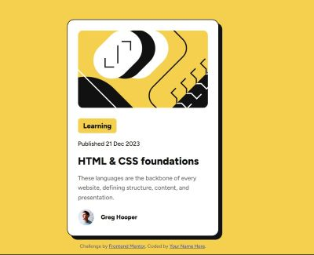

# Frontend Mentor - Blog preview card solution

This is a solution to the [Blog preview card challenge on Frontend Mentor](https://www.frontendmentor.io/challenges/blog-preview-card-ckPaj01IcS). Frontend Mentor challenges help you improve your coding skills by building realistic projects. 

## Table of contents

- [Overview](#overview)
  - [The challenge](#the-challenge)
  - [Screenshot](#screenshot)
  - [Links](#Links)
- [My process](#my-process)
  - [Built with](#built-with)
- [Author](#author)

## Overview

To build out a blog preview card and get it looking as close to the design as possible. Focus on using semantic HTML.

### The challenge

Users should be able to:

- See hover and focus states for all interactive elements on the page

### Screenshot

### Links

- Live Site URL: [View Bog Preview Card live](https://sclie001.github.io/WWC-FrontEndMentor/blog-preview-card-main)

## My process

Build from what I currently know. Then if there was something I forgot how to do with HTML or CSS, I used [W3Schools](https://w3schools.com) as a reference.

### Built with

- Semantic HTML5 markup
- CSS custom properties
- Flexbox
- CSS Grid
- Mobile-first workflow

## Author
- Frontend Mentor - [@sclie001](https://www.frontendmentor.io/profile/sclie001)