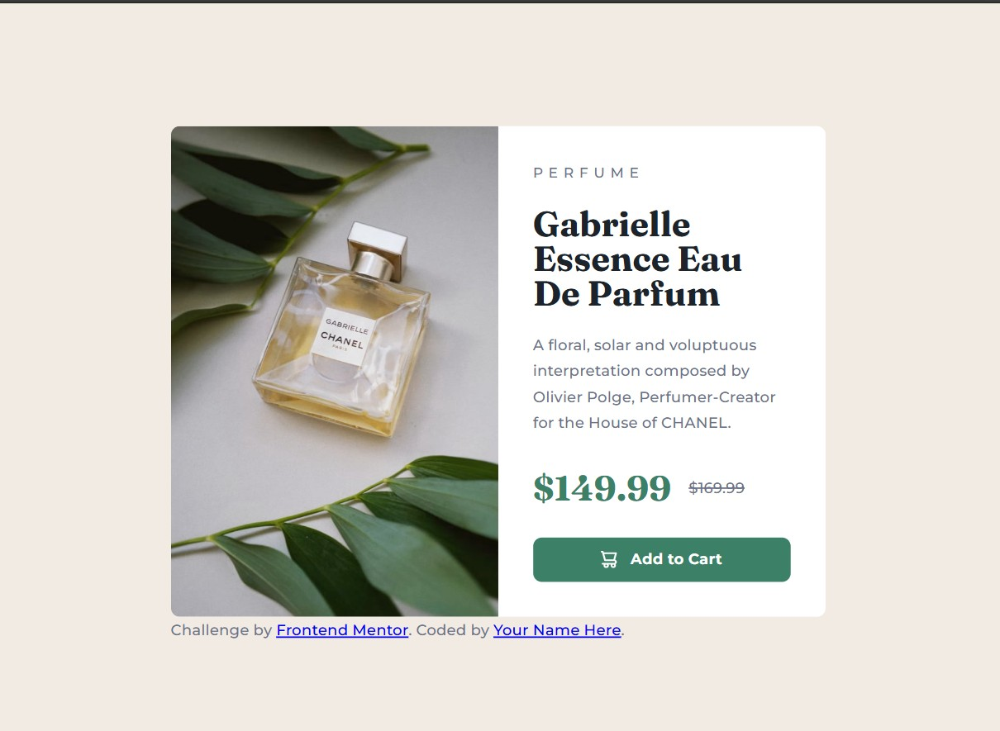

# Frontend Mentor - Product preview card component solution

This is a solution to the [Product preview card component challenge on Frontend Mentor](https://www.frontendmentor.io/challenges/product-preview-card-component-GO7UmttRfa). Frontend Mentor challenges help you improve your coding skills by building realistic projects. 

## Table of contents

- [Overview](#overview)
  - [The challenge](#the-challenge)
  - [Screenshot](#screenshot)
  - [Links](#links)
- [My process](#my-process)
  - [Built with](#built-with)
  - [What I learned](#what-i-learned)
  - [Useful resources](#useful-resources)
- [Author](#author)
- [Acknowledgments](#acknowledgments)

### The challenge

Users should be able to:

- View the optimal layout depending on their device's screen size
- See hover and focus states for interactive elements

### Screenshot




### Links

- Live Site URL: [View Product Preview live](https://sclie001.github.io/WWC-FrontEndMentor/product-preview-card-component-main/)

## My process

### Built with

- Semantic HTML5 markup
- CSS custom properties
- Flexbox
- CSS Grid
- Mobile-first workflow

### What I learned

I learned to use html to change an image based on screen size when it is not a background image. For example:

```html
<picture class="product__img">
  <source srcset="images/image-product-desktop.jpg" media="(min-width: 37.5em)">
  
</picture>
```

I also learned how to use the BEM naming convention for class names.

```html
<article class="product">
  <picture class="product__img">
    <source srcset="images/image-product-desktop.jpg" media="(min-width: 37.5em)">
    
  </picture>

  <div class="product__content">
    <p class="product__category">Perfume</p>...
```

One more thing I learned was how to use the data attribute to style the shopping cart button to have the icon display first

```html
<button class="button" data-icon="shopping-cart">Add to Cart</button>
```
```css
 .button[data-icon="shopping-cart"]::before{
    content: "";
    background-image: url("/images/icon-cart.svg");
    width: 15px;
    height: 16px;
  }
```

### Useful resources

- [Example resource 1](https://w3schools.com) - Used this resource for quick referencing and practicing on html or css concepts

- [Example resource 2](https://developer.mozilla.org) - Used this resource for referencing and more explanation of concepts

## Author
- Frontend Mentor - [@sclie001](https://www.frontendmentor.io/profile/sclie001)


